# RenCarApp - Araç Kiralama Platformu

RenCarApp, modern Android geliştirme standartları kullanılarak inşa edilmiş, uçtan uca araç kiralama süreçlerini yöneten kapsamlı bir mobil uygulama projesidir. Bu proje, kullanıcıların harita üzerinden araç bulmalarından, ehliyet doğrulama süreçlerine, kiralama başlatma ve bitirme adımlarından ödeme entegrasyonuna kadar tüm akışları içermektedir.

---

## 1. Uygulama Ekran Görüntüleri

### 1.1. Oturum Yönetimi ve Ehliyet Doğrulama
<table align="center">
  <tr>
    <td align="center"><b>Giriş Yap</b></td>
    <td align="center"><b>Kayıt Ol</b></td>
    <td align="center"><b>Ehliyet Doğrulama</b></td>
  </tr>
  <tr>
    <td>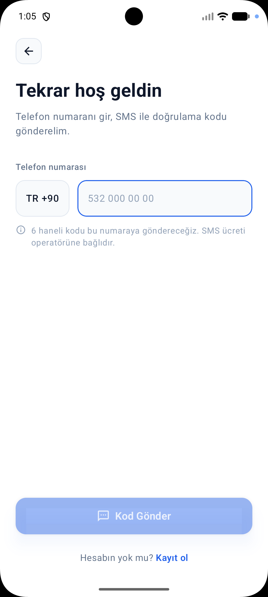</td>
    <td>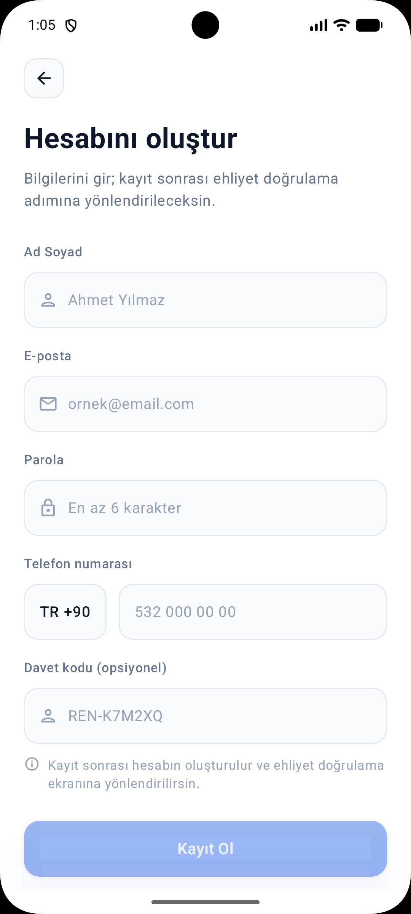</td>
    <td>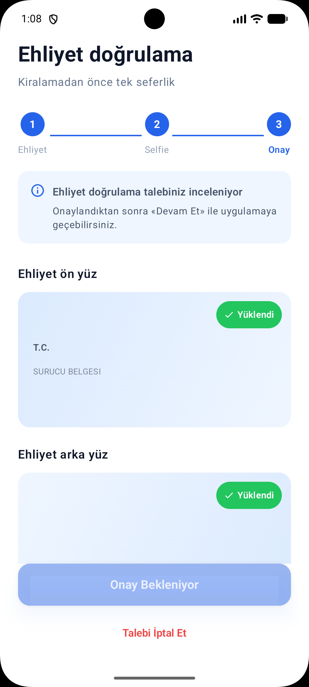</td>
  </tr>
</table>

### 1.2. Araç Keşfi ve Kiralama Akışı
<table align="center">
  <tr>
    <td align="center"><b>Ana Harita</b></td>
    <td align="center"><b>Araç Detay</b></td>
    <td align="center"><b>Rezervasyon Onayı</b></td>
  </tr>
  <tr>
    <td>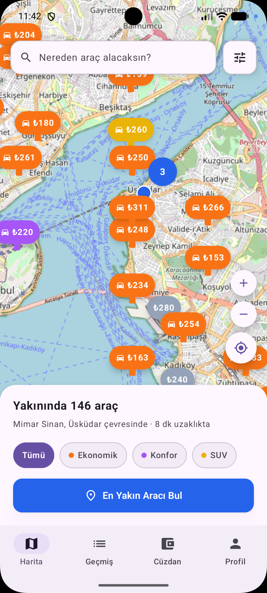</td>
    <td>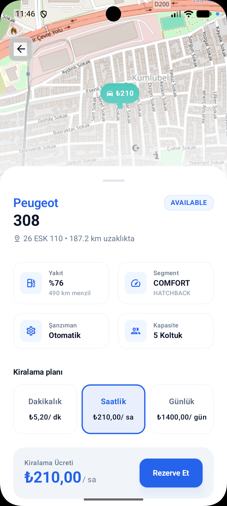</td>
    <td>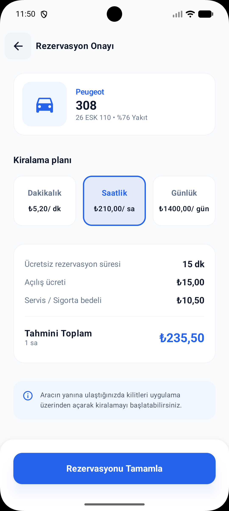</td>
  </tr>
</table>

### 1.3. Sürüş ve Operasyon
<table align="center">
  <tr>
    <td align="center"><b>Başlangıç Fotoğrafları</b></td>
    <td align="center"><b>Aktif Kiralama</b></td>
    <td align="center"><b>Kiralama Geçmişi</b></td>
  </tr>
  <tr>
    <td>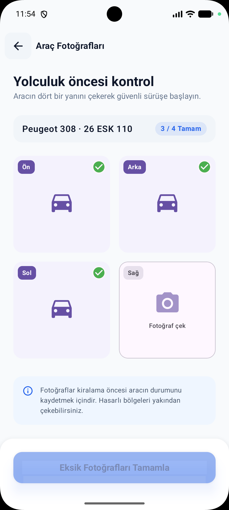</td>
    <td>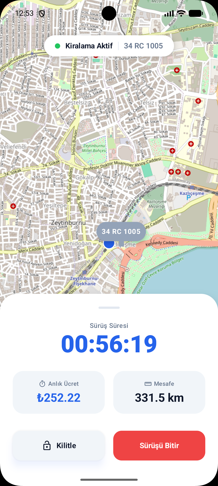</td>
    <td>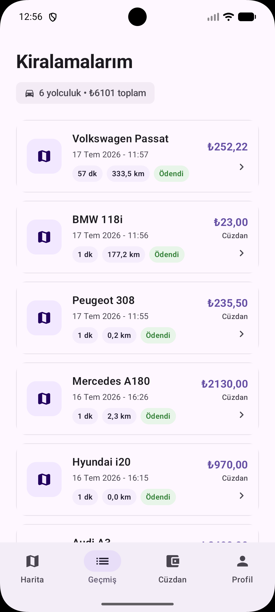</td>
  </tr>
</table>

### 1.4. Ödeme ve Cüzdan Yönetimi
<table align="center">
  <tr>
    <td align="center"><b>Cüzdanım</b></td>
    <td align="center"><b>Iyzico Ödeme</b></td>
    <td align="center"><b>Profil</b></td>
  </tr>
  <tr>
    <td>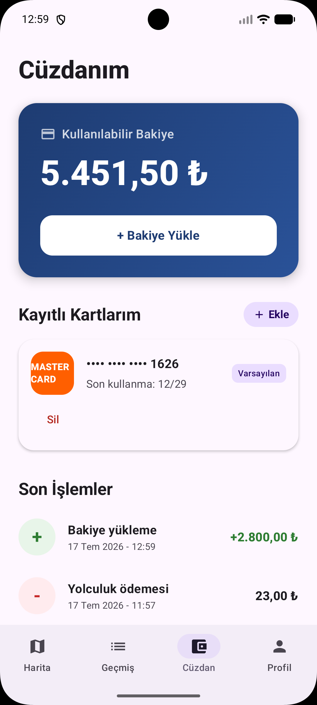</td>
    <td>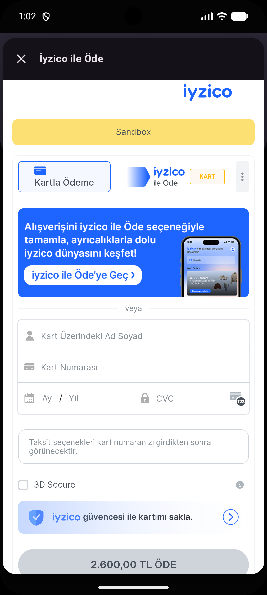</td>
    <td>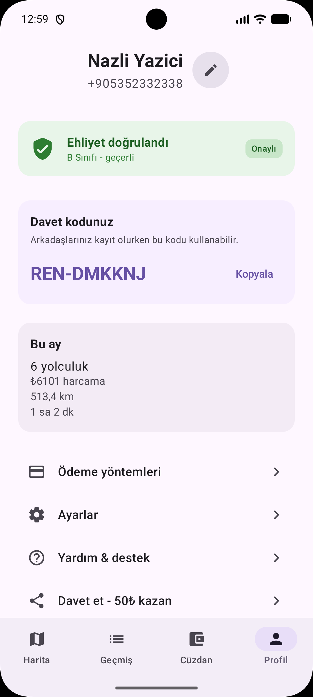</td>
  </tr>
</table>

### 1.5. Karanlık Mod ve Dinamik Temalar
<table align="center">
  <tr>
    <td align="center"><b>Genel Karanlık Mod</b></td>
    <td align="center"><b>Ödeme Detay (Dark)</b></td>
    <td align="center"><b>Kiralama Planı (Dark)</b></td>
  </tr>
  <tr>
    <td>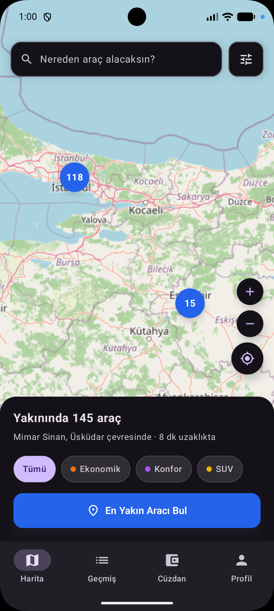</td>
    <td>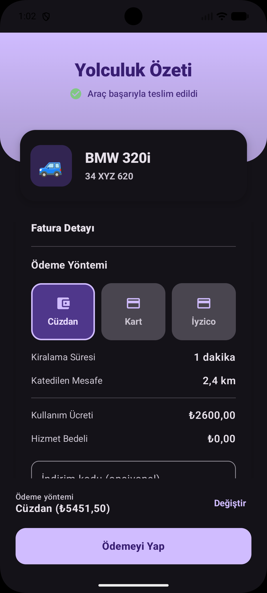</td>
    <td>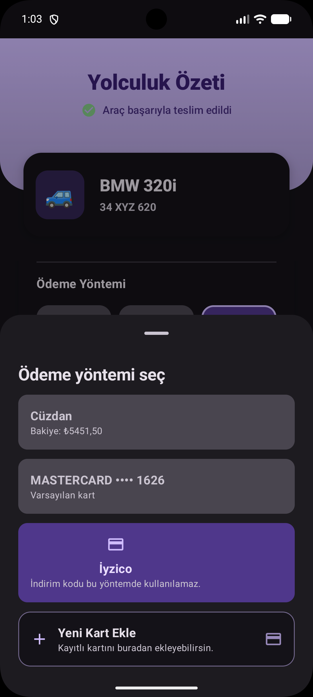</td>
  </tr>
</table>

---

## 2. Proje Özeti ve Kapsamı

RenCarApp, bir bitirme projesi olarak akademik ve sektörel standartlara uygun şekilde tasarlanmıştır. Uygulama, mikro mobilite ve araç paylaşım modellerini temel alarak aşağıdaki ana yetenekleri sunmaktadır:

- **Harita Tabanlı Keşif:** MapLibre ve OpenStreetMap entegrasyonu ile çevredeki araçların gerçek zamanlı görüntülenmesi.
- **Dinamik Kiralama Modelleri:** Dakikalık, saatlik ve günlük plan seçenekleri ile esnek kiralama imkanı.
- **Ehliyet ve Kimlik Doğrulama:** OCR ve fotoğraf yükleme süreçleri ile kullanıcı güvenliğinin sağlanması.
- **Gerçek Zamanlı Takip:** Socket.IO üzerinden aracın anlık konumunun ve kiralama süresinin takibi.
- **Güvenli Ödeme:** Cüzdan sistemi, kayıtlı kartlar ve Iyzico ödeme geçidi entegrasyonu.

---

## 3. Teknoloji Yığını

Uygulama, Google tarafından önerilen modern Android kütüphaneleri ve mimari yaklaşımlar üzerine inşa edilmiştir.

### 3.1. Temel Bileşenler
- **Dil:** Kotlin 2.2.10
- **UI Framework:** Jetpack Compose (Declarative UI)
- **Mimari:** MVI (Model-View-Intent)
- **Dependency Injection:** Hilt 2.59.2 (KSP destekli)
- **Navigasyon:** Compose Navigation 2.9.5 (Nested Graph yapısı)

### 3.2. Veri ve Ağ Katmanı
- **Networking:** Retrofit 2.11.0 & OkHttp 4.12.0
- **Serialization:** kotlinx.serialization 1.8.1
- **Persistence:** Jetpack DataStore (Preferences)
- **Real-time:** Socket.IO Client for Android

### 3.3. Harita ve Lokasyon
- **Map SDK:** MapLibre Android SDK 11.8.0
- **Tile Source:** OpenStreetMap (OSM)
- **Location:** Google Play Services Location

---

## 4. Mimari Yapı: MVI (Model-View-Intent)

Uygulama, veri tutarlılığını ve test edilebilirliği en üst düzeye çıkarmak için MVI mimarisini benimsemiştir.

- **State:** UI'ın herhangi bir andaki tek doğruluk kaynağı (Single Source of Truth). Immutable data class olarak tanımlanır.
- **Intent:** Kullanıcının gerçekleştirdiği eylemleri (buton tıklama, metin girişi vb.) temsil eden mühürlü arayüzler.
- **Effect:** Navigasyon veya bildirimler gibi bir kez tetiklenen (one-shot) olaylar için Channel yapısı kullanılır.

Veri akışı tek yönlüdür: **User → Intent → ViewModel → State/Effect → UI**.

---

## 5. Navigasyon ve Ekran Akışları

Uygulama, karmaşık akışları yönetmek için iç içe geçmiş (nested) navigasyon grafiklerini kullanmaktadır.

### 5.1. Navigasyon Grafikleri
1. **Splash:** Oturum kontrolü ve başlangıç yönlendirmesi.
2. **Auth Graph:** Onboarding, Login, Register ve Ehliyet Doğrulama süreçleri.
3. **Main Graph:** Alt gezinme çubuğu (BottomBar) içeren ana sekmeler:
   - Ana Harita
   - Kiralama Geçmişi
   - Cüzdan / Ödeme
   - Profil
4. **Rental Graph:** Kiralama sürecine özel, bottom bar'ın gizlendiği detaylı akış.

### 5.2. Kullanıcı Rolü Yönetimi
Sistem, API'dan dönen kullanıcı rollerine göre dinamik yönlendirme yapar:
- **PENDING:** Ehliyet onayı eksik olan kullanıcılar otomatik olarak doğrulama ekranına yönlendirilir.
- **CUSTOMER:** Tam yetkili kullanıcılar ana harita akışına erişebilir.

---

## 6. Ekran Envanteri ve Özellikler

| Ekran | Açıklama | Teknik Detay |
|-------|----------|--------------|
| **Ana Harita** | Araçların konumlarını ve fiyatlarını gösterir. | MapLibre GeoJSON Clustering, Haversine Mesafe Hesaplama |
| **Araç Detay** | Araç özelliklerini ve kiralama planlarını sunar. | Dinamik Plan Seçimi, Quote API Entegrasyonu |
| **Ehliyet Doğrulama** | Kamera ile ehliyet ve selfie yükleme süreci. | Multipart/form-data upload, Kamera API |
| **Aktif Kiralama** | Sürüş esnasındaki sayaç ve araç kilidi kontrolü. | Socket.IO Canlı Konum, Foreground Service Simülasyonu |
| **Cüzdan** | Bakiye yükleme ve harcama geçmişi. | Iyzico Checkout Form, İşlem Geçmişi Listeleme |

---

## 7. Veri Katmanı ve API Entegrasyonu

Uygulama, merkezi bir `AuthorizedRequestExecutor` yapısı üzerinden tüm ağ isteklerini yönetir.

- **Token Yönetimi:** Access ve Refresh Token mekanizması ile kesintisiz oturum yönetimi.
- **Hata Yönetimi:** API bazlı hata kodlarının (409 Conflict, 403 Forbidden vb.) kullanıcı dostu mesajlara dönüştürülmesi.
- **Stub/Fake Katmanı:** Geliştirme sürecinde API bağımsız ilerlemek için Repository Interface desenleri ve Fake implementasyonlar kullanılmıştır.

---

## 8. Klasör Yapısı

```text
com.turkcell.rencarapp/
├── data/               # Repository, DTO ve API tanımları
│   ├── auth/           # Oturum ve kullanıcı yönetimi
│   ├── vehicle/        # Araç listeleme ve detay
│   ├── rental/         # Kiralama ve rezervasyon işlemleri
│   └── network/        # Retrofit modülleri ve interceptor'lar
├── ui/                 # Sunum katmanı (MVI)
│   ├── navigation/     # NavHost ve Route tanımları
│   ├── components/     # Ortak UI bileşenleri
│   └── <feature>/      # Contract, ViewModel ve Screen dosyaları
└── di/                 # Hilt modülleri (Dependency Injection)
```

---

## 9. Kurulum ve Çalıştırma

1. Projeyi klonlayın: `git clone https://github.com/RenCar-gygy/RenCar-gygy.git`
2. Android Studio (Ladybug veya üstü) ile açın.
3. Gradle senkronizasyonunun tamamlanmasını bekleyin.
4. Gerekli API anahtarları ve Base URL yapılandırması `decisions.md` dosyasındaki güncel değerlere göre `NetworkModule` içinde kontrol edilmelidir.
5. Uygulamayı bir emülatör veya fiziksel cihazda çalıştırın.


---
*Bu proje Turkcell Android Geliştirme Programı kapsamında bir bitirme projesi olarak hazırlanmıştır.*
